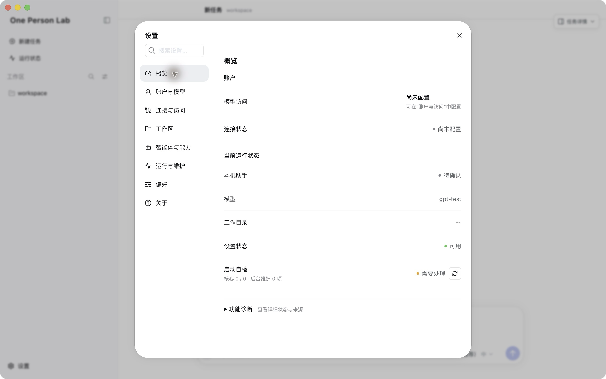

## 安装与首次使用

新版 One Person Lab App 使用统一工作台，复用本机 Codex 会话与已有模型配置。

{width=72%}

- 使用 Apple Silicon（arm64）Mac。
- 首次安装推荐 Full；已有安装的升级使用 Standard 更新。
- Full 也需要网络完成登录和在线模型访问。

## 1. 下载并安装

最新版本：<{{download.latest_release_url}}>

`One-Person-Lab-Full-<版本>-mac-arm64.dmg`

{width=70%}

- 打开 DMG，将 One Person Lab 拖入 Applications。
- 复制完成后，从“应用程序”启动。
- 不要下载 ZIP、blockmap、YML、JSON 或 Source code。
- Standard 需在线下载运行模块；网络条件不佳时优先 Full。

## 2. 完成本机准备

首次启动检查工作目录、本机助手和模型访问。

{width=78%}

- “重新检查”刷新结果。
- “打开设置”处理模型访问。
- “稍后处理”先进入工作台，不代表缺失配置已完成。

## 3. 账户与模型

打开“设置 → 账户与模型 → 账户与访问”。

{width=78%}

- 已有 Codex 或 Gateway 配置时先查看状态，通常无需重新登录。
- 新用户选择 OPL Gateway 账户，填写邮箱和密码并“登录”。
- 手工接入使用“API Key → 配置”。
- 登录后确认本机默认模型来源，按需切换；模型在同组的“模型”页面。

## 4. 开始工作

选择工作区，在新任务中说明目标与材料位置。

{width=78%}

- 可从智能体选择器选择已安装能力。
- 附件入口可添加文件或 Skill。
- 研究材料应事先脱敏，并遵守机构要求。

## 5. 状态与更新

概览展示日常摘要；功能诊断按需展开。

{width=78%}

- 账户与模型、工作区、运行与维护各有对应设置入口。
- “关于”提供版本、检查更新及安装教程。
- Full 首装后也使用 Standard 更新路径。

## 升级与会话

- 旧正式版和 Studio Preview 通过各自更新入口转入正式 App。
- 复用同一 Codex 数据目录时，OPL 与 Codex App 直接读取同一批原生会话。
- 不复制对话，不自动引入独立 AionUI 或 Gemini 历史。
- 旧 OPL 的置顶、排序等元数据关联已确认的原生线程。
- 密码和 API Key 不应公开转发或写入研究材料。
