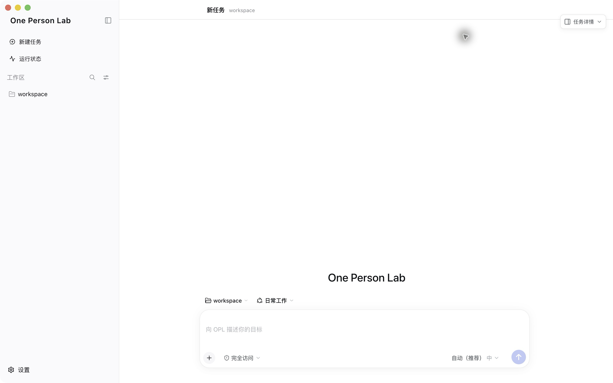
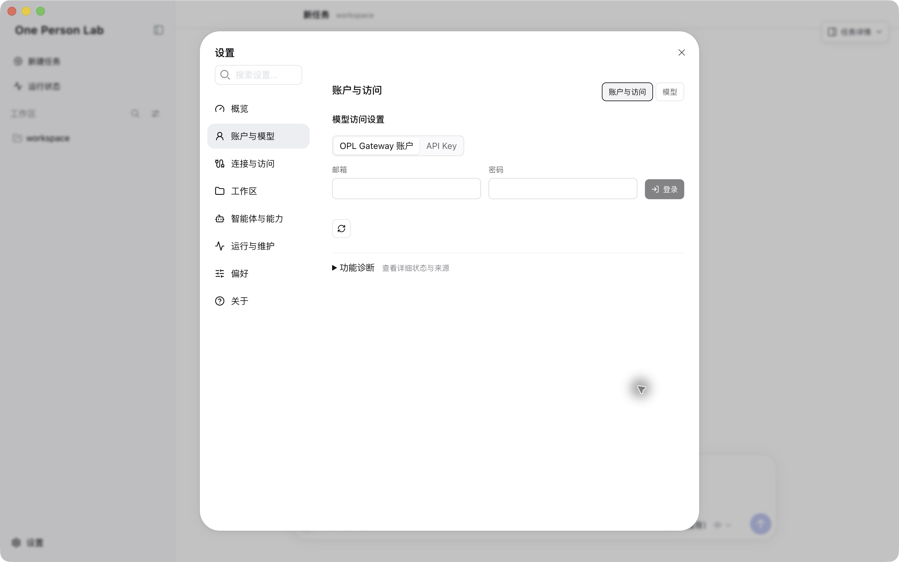

## 首次安装与首启

按安装、首次检查、登录或确认模型访问、进入工作台的顺序操作。

`One-Person-Lab-Full-<版本>-mac-arm64.dmg`

{width=72%}

- 一台 Apple Silicon（arm64）Mac；当前 macOS App 不支持 Intel Mac。
- Full 也需要稳定网络；Standard 还需在线下载模块，网络要求更高。
- 默认使用 OPL Gateway 账户登录；已有可用 Codex 配置时可以直接重新检测。

## 1. 安装 One Person Lab

首次安装推荐从最新 Release 下载 Full DMG；Standard 适合升级，或网络环境非常好的联网安装。

最新版本：<{{download.latest_release_url}}>

{width=70%}

- Homebrew Cask 安装到 `/Applications`；完成后运行 `open -a "One Person Lab"`。
- 系统阻止打开时，改用 Latest Release 的 `opl-install.sh`。
- 首次安装选 Full DMG。
- Standard 会在线下载 Base、Packages 等模块；使用 OpenAI 时需要能够直连 OpenAI。
- 不要下载 ZIP、blockmap、YML、JSON 或 Source code。
- 页面版本号会持续变化，以标记为 Latest 的稳定版为准；教程不保留固定版本截图。

## 2. 手工安装 DMG

仅在手工下载时执行：打开 DMG，将 One Person Lab 拖入 Applications，复制完成后从“应用程序”启动。

{width=70%}

- 首次打开如有安全提示，按系统提示确认。
- 不要长期在 DMG 挂载窗口内运行 App。
- 系统持续阻止打开时，改用 Latest Release 的 `opl-install.sh` 完成摘要校验、quarantine 清理和启动。

## 3. 完成首次检查

首次启动后，OPL 会先检查工作目录、本机助手和模型访问，并显示当前进度。

{width=78%}

- 检查期间可以先“进入 OPL”，但不会自动完成缺失项目。
- 出现“需要处理”时，按页面给出的下一步操作。
- 普通用户不需要理解折叠在“技术细节”中的底层工具。

## 4. 登录或确认模型访问

默认填写 OPL Gateway 邮箱和密码并“登录并继续”；已有 Codex 配置时可独立重新检测，API Key 仅作为兼容方式。

{width=78%}

- 默认方式：账户登录；可信服务主机是 `gateway.medopl.com`。
- App 自动写入 `oplgateway` 和 `https://gateway.medopl.com/v1`，无需手工填写 Base URL。
- 已有 Gateway 配置会原位复用，不会隐式迁移旧配置。
- 已有 Codex 配置可“重新检测”；API Key 只作为兼容方式。
- 暂不配置时可先“进入 OPL”，之后从“设置 -> 账户与访问”继续。

## 5. 确认模型访问

账户登录成功后，还要明确确认把 OPL Gateway 用作模型访问方式。

{width=78%}

- 看到“已登录 OPL Gateway”后，点击“设为模型访问方式”。
- 登录只确认账户身份，不会自动替用户修改模型访问方式。
- 确认完成后，首次设置才会进入已就绪状态。

## 6. 开始第一项工作

进入主界面后，直接描述目标，或选择当前安装的 Package 动态提供的工作入口。

{width=78%}

- 第一条任务同时说明目标和材料位置。
- 工作入口随已安装和启用的 Package 变化，截图只作操作示意。
- 涉及患者或敏感数据时，先完成脱敏并遵守机构要求。
- 账户与访问在“设置 -> 账户与访问”，模型选择在“设置 -> 模型”。

## 常见问题

- Intel Mac：当前不支持，请使用 Apple Silicon（arm64）Mac。
- 已有 Codex 配置：点击“重新检测已有配置”，不需要先登录 Gateway。
- 暂时没有账户或 API Key：可以先进入 OPL，后续再配置。
- 下载文件很多：首次安装选择 `Full-<版本>-mac-arm64.dmg`，不要下载 ZIP、Source code 或元数据文件。
- Standard 卡住：先排查网络、代理、DNS 和模型服务连通性；OpenAI 使用场景需要能直连 OpenAI。
- 打不开 App：确认已复制到 Applications，或使用 Latest Release 的 `opl-install.sh` 安装。

> 密码只用于本次登录；请勿公开转发或保存 API Key 到研究目录、论文附件或代码仓库。
